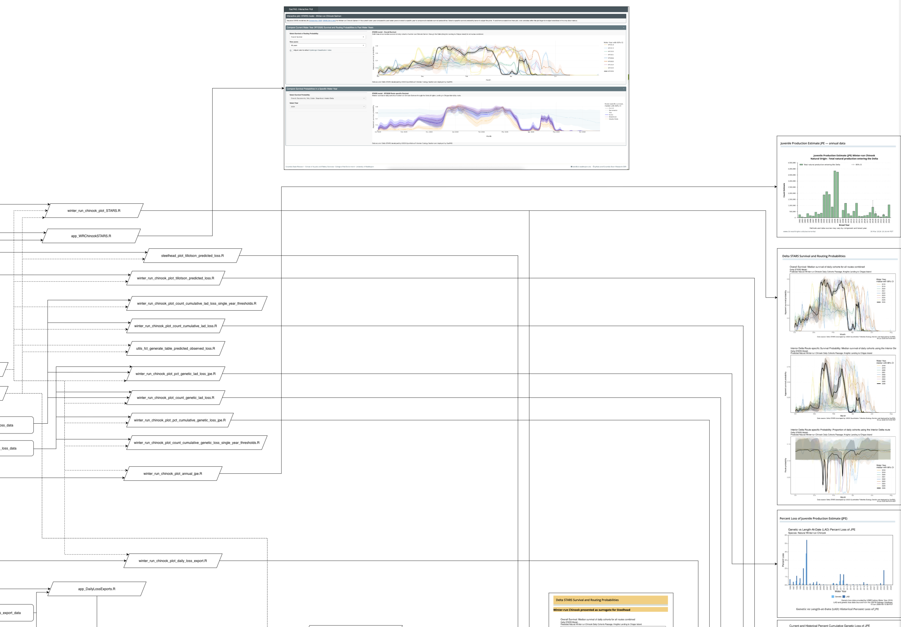

# [Track-a-Cohort](https://www.cbr.washington.edu/sacramento/cohort/index.html#juvindelta)

## **Overview**

This repo includes code to generate figures for the SacPAS Track-a-Cohort webpage, as well as two accompanying Shiny apps, "Interactive plot: STARS model - Winter-run Chinook Salmon" and "Daily Total Loss and CVP/SWP Exports." The Shiny apps can be accessed from the "Interactive plot" buttons on the Track-a-Cohort webpage.

Data concerns winter run Chinook Salmon and Steelhead in the Sacramento River.

## **Quick start**

Before running the complete Quarto page or individual R scripts, first update the data supporting the R scripts:

``` r
source(file.path(getwd(), "R/update_data.R"))
```

To run the Quarto page and re-generate all plots, either 1) run `make` in the terminal or 2) open one of `TAC_chinook_figures.qmd` and `TAC_steelhead_figures.qmd` and click `Build` in Rstudio. To regenerate individual plots, locate the appropriate script and either 1) run `Rscript R/SCRIPT_NAME.R` at the R console or 2) click `Run` in Rstudio. The code diagram below may help you identify dependencies between scripts.

## **Repo structure**

Each R script within the R/ folder is commented using Roxygen notation and the packages needed to run. The `R/` folder contains scripts and helper function that are needed to create the final plots. For data generation used in plots, see the `data-raw/`folder. Each build updates the `data-raw/` folder and writes outputs to the `data/` folder (which is later called within the `R/` folder plots and functions).

## **Plots not updating**

If plots are not updating as expected, either 1) run `make` in the terminal or 2) click `Build` in the panel tabs; then, see console output to determine which file is causing an error. If that does not work, try running `source(file.path(getwd(), "R/update_data.R"))` to see if a certain dataset is not updating properly. Once determined, inspect that file or downstream files to fix any errors.

## **Code diagram**

This image is a preview of the available code diagram, which depicts dependencies between scripts, data outputs, and figures: 

[Download the full diagram here.](www/code_diagram.pdf)
